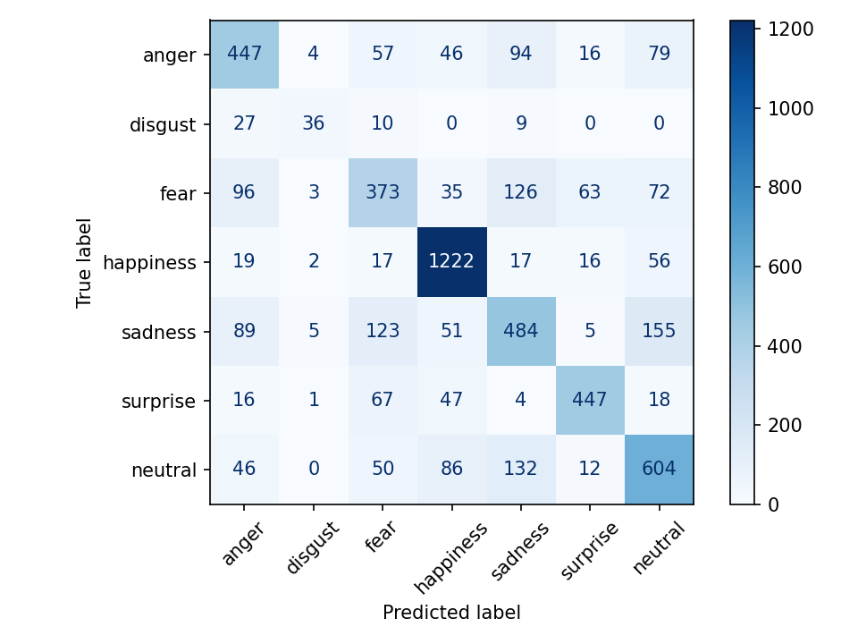
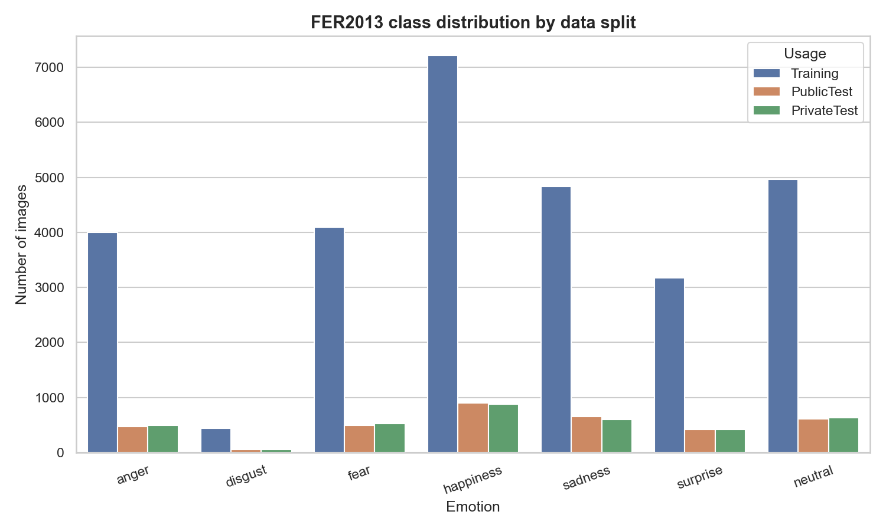

# Facial Emotion Recognition

A deep-learning facial-emotion classifier built in Python — trained on the
**FER2013** dataset with a **VGG-19** transfer-learning model, complete with
command-line tools, a real-time webcam demo, and a polished **Gradio web UI** for
live exhibitions.

The model recognizes 7 emotions: **anger, disgust, fear, happiness, sadness,
surprise, neutral**.

## Results

- **Test accuracy: 67.1%** on a held-out 15% test split (strong for FER2013 —
  human accuracy is ~65%, published SOTA ~73%).
- Trained VGG-19 (ImageNet weights) → GlobalAveragePooling → Dense(7, softmax).
- Stratified **70 / 15 / 15** train / validation / test split.

| Emotion    | F1-score |
|------------|----------|
| happiness  | 0.86     |
| surprise   | 0.77     |
| neutral    | 0.63     |
| anger      | 0.60     |
| sadness    | 0.54     |
| disgust    | 0.54     |
| fear       | 0.51     |



### Dataset note: class imbalance

FER2013 is heavily imbalanced — `happiness` has ~25% of samples while `disgust`
has only ~1.5% (a 16× gap). This directly impacts per-class recall (disgust is
the hardest class). See `plot_distribution.py`.



## Project layout

| File | Purpose |
|------|---------|
| `train_fer2013.py` | Train VGG-19 on FER2013 (70/15/15 split, class metrics) |
| `predict_fer.py` | Classify emotion in image files / folders (CLI) |
| `webcam_fer.py` | Real-time emotion recognition from a webcam (OpenCV) |
| `app.py` | **Gradio web UI** — webcam + upload, for live demos/exhibitions |
| `plot_distribution.py` | Bar charts of the FER2013 class distribution |
| `facial-emotion-recognition-vgg19-fer2013.ipynb` | Original notebook walkthrough |
| `train_classifier.py` | Alternative generic image classifier (PyTorch) |
| `train_classifier_keras.py` / `predict.py` | Alternative generic classifier (Keras) |

## Setup

```bash
pip install -r requirements.txt
```

> **Note:** TensorFlow is CPU-only on native Windows (≥ 2.11). Use WSL2 or a Linux
> machine with CUDA for GPU acceleration.

### Get the data / model (not in this repo — too large for GitHub)

- **`fer2013.csv`** — download from
  [Kaggle: FER2013](https://www.kaggle.com/datasets/msambare/fer2013) (or the
  Facial Expression Recognition Challenge) and place it in the project root.
- **`best_model_fer.keras`** — produced by running training (below).

## Usage

**Train the model:**
```bash
python train_fer2013.py --epochs 25 --batch-size 32
```
Produces `best_model_fer.keras`, `fer_classes.json`, `confusion_matrix.png`,
and `training_curves.png`.

**Classify images:**
```bash
python predict_fer.py --input my_photo.jpg
python predict_fer.py --input ./photos --topk 3 --detect   # detect+crop faces
```

**Real-time webcam (OpenCV window):**
```bash
python webcam_fer.py            # press q to quit, s to snapshot
```

**Exhibition web UI (Gradio):**
```bash
python app.py                  # opens http://127.0.0.1:7860
FER_SHARE=1 python app.py      # creates a temporary public share link
```

**Visualize the dataset:**
```bash
python plot_distribution.py
python plot_distribution.py --by-usage
```

## Tech stack

TensorFlow / Keras · OpenCV · scikit-learn · pandas · matplotlib / seaborn ·
Gradio · (optional PyTorch pipeline)

## License

MIT
