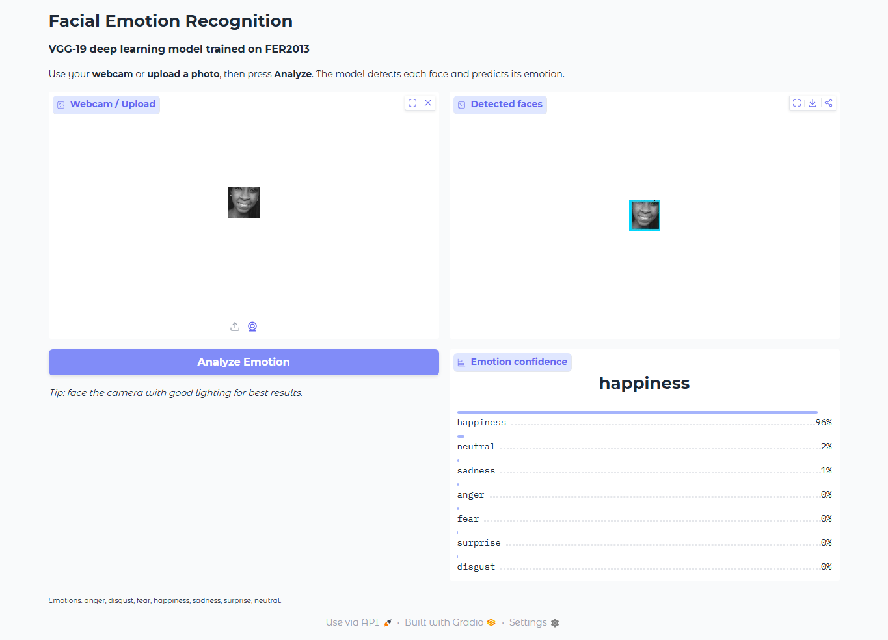

# Facial Emotion Recognition

A deep-learning facial-emotion classifier trained on the **FER2013** dataset with
a **VGG-19** transfer-learning model. The project includes command-line
prediction, evaluation, a webcam script, and a **Gradio web UI** for uploaded
images or live demos.

The model recognizes 7 emotions: **anger, disgust, fear, happiness, sadness,
surprise, neutral**.

## Demo



## Results

- VGG-19 (ImageNet weights) -> GlobalAveragePooling -> Dense(7, softmax).
- Stratified **70 / 15 / 15** train / validation / test split.
- A baseline reaches **67.1% test accuracy**.
- The shipped model uses softened class weighting to improve minority-class
  behavior at a small cost to raw accuracy.

| Metric | Baseline | Class-weighted (shipped) |
|--------|----------|--------------------------|
| Accuracy | 0.671 | 0.660 |
| Balanced accuracy | ~0.62 | 0.641 |
| Macro-F1 | 0.637 | 0.630 |
| Disgust recall | 0.44 | 0.62 |


### Handling Class Imbalance

FER2013 is heavily imbalanced: `happiness` has ~25% of samples while `disgust`
has only ~1.5%. Balanced accuracy and macro-F1 are the most useful metrics under
this imbalance because they weight every class equally.


`train_fer2013.py` includes:

- `--class-weights`: reweight rare classes.
- `--weight-scheme sqrt`: soften extreme balanced weights.
- `--loss focal`: optional focal loss experiment.
- `--monitor val_macro_f1`: select checkpoints using macro-F1.
- `--clipnorm`: gradient clipping for stability.

## Project Layout

| File | Purpose |
|------|---------|
| `app.py` | Gradio UI for upload/webcam emotion recognition |
| `predict_fer.py` | CLI prediction for image files or folders |
| `train_fer2013.py` | Train VGG-19 on FER2013 |
| `evaluate.py` | Evaluate a saved model on the held-out test split |
| `face_detect.py` | Shared MediaPipe/Haar face detection |
| `fer_preprocess.py` | Shared cropping, lighting, and TTA preprocessing |
| `webcam_fer.py` | OpenCV webcam/video inference |
| `plot_distribution.py` | FER2013 distribution charts |

## Setup

```bash
pip install -r requirements.txt
```

> TensorFlow is CPU-only on native Windows for versions >= 2.11. Use WSL2 or a
> Linux machine with CUDA for GPU acceleration.

### Data And Model Artifacts

Large files are intentionally **not committed** to this repository:

- `fer2013.csv` is ~288 MB and is ignored by `.gitignore`.
- `model_classweights.keras` is ~230 MB and is ignored by `.gitignore`.

To run inference, place `model_classweights.keras` in the project root. You can
produce it locally with the recommended training command below, or upload the
trained model to a release/Drive/Hugging Face asset and download it into the
root with this filename.

To train from scratch, download FER2013 from Kaggle or the Facial Expression
Recognition Challenge and place `fer2013.csv` in the project root.

## Usage

**Train the model:**

```bash
python train_fer2013.py --epochs 25 --batch-size 32
python train_fer2013.py --class-weights
python train_fer2013.py --class-weights --loss focal
```

The baseline writes `best_model_fer.keras`. The recommended class-weighted run
writes `model_classweights.keras`. Training also produces `fer_classes.json`,
`confusion_matrix.png`, and `training_curves.png`.

**Evaluate a saved model:**

```bash
python evaluate.py --model model_classweights.keras --cm-out confusion_matrix.png
```

**Classify uploaded/static images:**

```bash
python predict_fer.py --input my_photo.jpg --detect --topk 3
python predict_fer.py --input ./photos --detect --csv results.csv
```

**Run the web UI:**

```bash
python app.py
```

**Run webcam/video inference:**

```bash
python webcam_fer.py
python webcam_fer.py --video clip.mp4
```

**Visualize dataset distribution:**

```bash
python plot_distribution.py
```

## Limitations

This is a portfolio/demo project, not a psychological assessment tool. Facial
emotion recognition is sensitive to lighting, pose, camera quality, face crop,
dataset bias, and expression ambiguity. It works best on clear, front-facing
faces and should be treated as an approximate computer-vision demo rather than a
reliable measure of a person's real emotional state.

## Tech Stack

TensorFlow / Keras, OpenCV, MediaPipe, scikit-learn, pandas, matplotlib,
seaborn, Gradio.

## License

MIT
